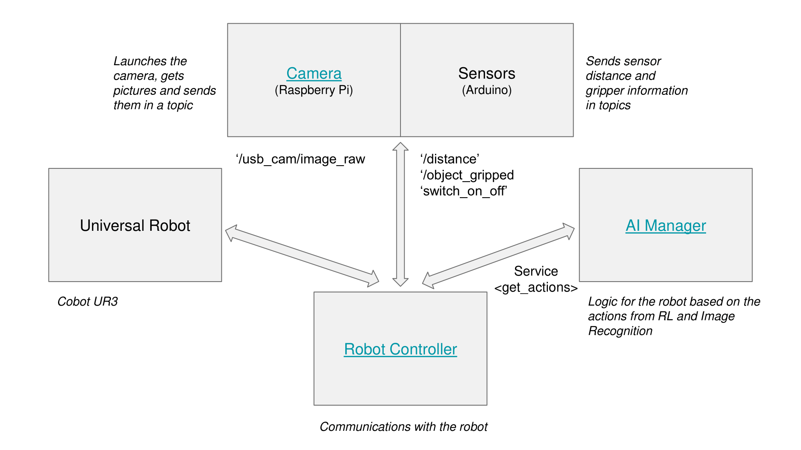

# ai_manager
_ai_manager_ is just one of the pieces of a bigger project that aims to control a robotic arm to perform a pick and place 
task of disordered pieces placed in a box. The robot has to be controlled by a software able to identify the objects,
and the best set of movements available to empty the box as fast as possible.

This Software is made using a microservices Architecture with ROS (Robotic operative System), and ai_manager is one of 
the modules of this architecture, as we can see in the following image:

_ai_manager_ module is the "intelligence" of the robot, responsible for making it learn by training a Deep Reinforcement 
Learning Algorithm. Using this algorithm, the robot (**agent**) will explore the **Environment** by performing a set of
**actions**. Once these actions are performed, the agent will receive a **reward** that can be positive, neutral or 
negative depending on how far the agent it from the **objective**.

Each time the agent perform an action, it reaches a new **state**. States can be transitional or terminal, when the 
agent meets the objective or when it gets to a forbidden position. Each time the agent reaches a terminal state, an
**episode** is ended, and a new one is started.

## Definition of the problem

The objective of the agent is thus the first thing that has to be defined. It is simple: **pick a piece**. 

Then, the environment, the states and the actions have to be defined together. These decisions are conditioned by the 
hardware and materials available. In our case, we have a UR3 robot with six different points of movements, and a vacuum
gripper. That means that the best way of griping an object is by facing the gripper to the floor and move it vertically 
until it gets in contact with the object, where the vacuum can be powered on, and we can know if the object has been 
griped or not.

Having this in mind, we have decided that the robot have to be fixed in a specific height with the gripper facing down.
Then, the actions will be "**north**", "**south**", "**east**" or "**west**" to move the robot through the x-y plane 
formed by these movements in the selected robot height, "**pick**", to perform the gripping process described before and
place the object in the box, and "**random_state**" to move the robot to a new random state when a terminal state is 
reached.

### Environment.py

The environment is defined in Environment.py class. There, we can find different parameters and methods. All of them are 
explained in the code, but we will briefly explain them here. The `CARTESIAN_CENTER` and the `ANGULAR_CENTER` represent 
the same point in the space, but using different coordinates. This point should be the x-y center of the picking box
with the robot height defined before as z point. As starting point, we need to use the `ANGULAR_CENTER` because we want
the robot to reach this point with the gripper facing down.

Then, we have to define the edges of the box as terminal states, because we just one the robot to explore inside the 
box. To define these limits, we use `X_LENGTH` and `Y_LENGTH` parameters, which are the X and Y lengths of the box in 
cm.

Other important parameters to define are the center of the box where we will place all the objects 
(`PLACE_CARTESIAN_CENTER`) or the distance that the robot has to move in each action (`ACTION_DISTANCE`).

Finally, the methods defined in this class are:

- `generate_random_state(strategy='ncc')`, which is used when the agent reaches a terminal state and needs a new random 
  state.
- `get_relative_corner(corner)`, which returns the relative coordinates of a corner of the box
- `is_terminal_state(coordinates, object_gripped)`, which returns a boolean telling whether a given state is terminal or
  not using the parameters given.
  
### Rewards

Rewards are one of the most difficult-to-define parameters. In this case, rewards are deffined in the EnvManager inner 
class of RLAlgorithm.py. The specific value of the rewards are not given here because they are different from one
training to another, but we give (positive or negative) rewards for:

- Terminal state after picking a piece.
- Terminal state after exceeding the box limits.
- Non terminal state after a pick action
- Other non terminal states

## Algorithm
The algorithm used in this project is a deep Q Learning algorithm. In this type of algorithms, images are used as inputs.
These images represent the state of the agent and are passed through a convolutional neural network in order to extract 
its features. 

In our case, the camera is sticked to the robot and moves with it giving a partial view of the environment. The absolute

